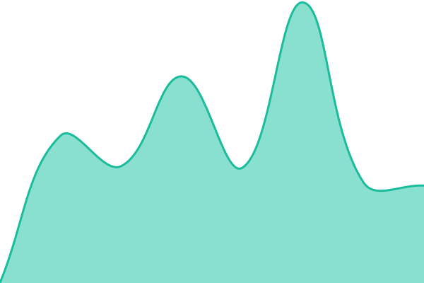
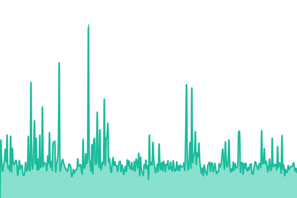
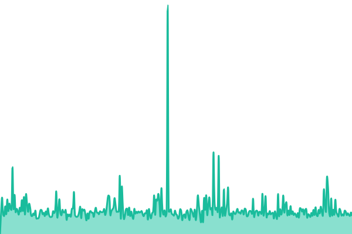
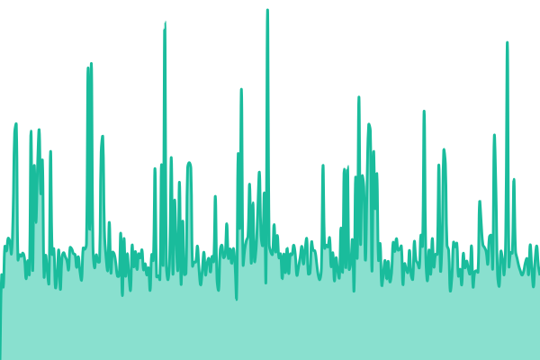
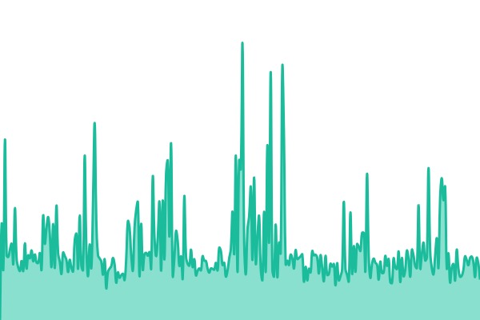
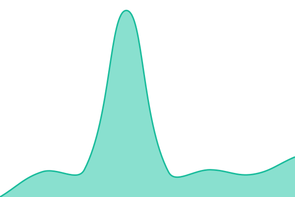
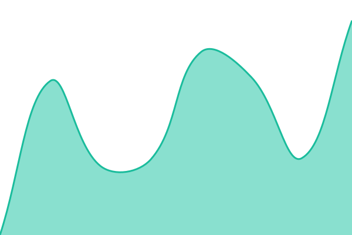

# [📈 Service Status](https://sunnylqm.github.io/upptime)

Uptime monitoring powered by [Upptime](https://github.com/upptime/upptime).

<!--start: status pages-->
<!-- This summary is generated by Upptime (https://github.com/upptime/upptime) -->
<!-- Do not edit this manually, your changes will be overwritten -->
<!-- prettier-ignore -->
| URL | Status | History | Response Time | Uptime |
| --- | ------ | ------- | ------------- | ------ |
|  [React Native CN CDN](https://dl.react-native.cn/test) | 🟩 Up | [react-native-cn-cdn.yml](https://github.com/sunnylqm/upptime/commits/HEAD/history/react-native-cn-cdn.yml) | 

 577ms
     
 | 

<a href="https://sunnylqm.github.io/upptime/history/react-native-cn-cdn">100.00%</a>
    

|  [Pushy CDN](https://pushy.cdn.dfyun.com.cn/test) | 🟩 Up | [pushy-cdn.yml](https://github.com/sunnylqm/upptime/commits/HEAD/history/pushy-cdn.yml) | 

 5881ms
     
 | 

<a href="https://sunnylqm.github.io/upptime/history/pushy-cdn">100.00%</a>
    

|  [Charmlot CDN](https://dl.charmlot.com/test) | 🟩 Up | [charmlot-cdn.yml](https://github.com/sunnylqm/upptime/commits/HEAD/history/charmlot-cdn.yml) | 

 537ms
     
 | 

<a href="https://sunnylqm.github.io/upptime/history/charmlot-cdn">100.00%</a>
    

|  [RNUpdate 1](https://1.rnupdate.online/api/task/list) | 🟩 Up | [rn-update-1.yml](https://github.com/sunnylqm/upptime/commits/HEAD/history/rn-update-1.yml) | 

 1645ms
     
 | 

<a href="https://sunnylqm.github.io/upptime/history/rn-update-1">100.00%</a>
    

|  [RNUpdate 2](https://2.rnupdate.online/api/task/list) | 🟩 Up | [rn-update-2.yml](https://github.com/sunnylqm/upptime/commits/HEAD/history/rn-update-2.yml) | 

 1535ms
     
 | 

<a href="https://sunnylqm.github.io/upptime/history/rn-update-2">100.00%</a>
    

|  [RNUpdate 3](https://3.rnupdate.online/api/task/list) | 🟩 Up | [rn-update-3.yml](https://github.com/sunnylqm/upptime/commits/HEAD/history/rn-update-3.yml) | 

 1559ms
     
 | 

<a href="https://sunnylqm.github.io/upptime/history/rn-update-3">100.00%</a>
    

|  [RNUpdate 4](https://4.rnupdate.online/api/task/list) | 🟩 Up | [rn-update-4.yml](https://github.com/sunnylqm/upptime/commits/HEAD/history/rn-update-4.yml) | 

 1596ms
     
 | 

<a href="https://sunnylqm.github.io/upptime/history/rn-update-4">100.00%</a>
    

|  [ReactNative CN API](https://p.reactnative.cn/api/task/list) | 🟩 Up | [react-native-cn-api.yml](https://github.com/sunnylqm/upptime/commits/HEAD/history/react-native-cn-api.yml) | 

 1149ms
     
 | 

<a href="https://sunnylqm.github.io/upptime/history/react-native-cn-api">100.00%</a>
    

|  [ReactNative CN S1](http://s1.reactnative.cn/api/task/list) | 🟩 Up | [react-native-cn-s1.yml](https://github.com/sunnylqm/upptime/commits/HEAD/history/react-native-cn-s1.yml) | 

 839ms
     
 | 

<a href="https://sunnylqm.github.io/upptime/history/react-native-cn-s1">100.00%</a>
    

|  [Update Entry (react-native.cn)](https://update.react-native.cn/api/task/list) | 🟩 Up | [update-entry-react-native-cn.yml](https://github.com/sunnylqm/upptime/commits/HEAD/history/update-entry-react-native-cn.yml) | 

 924ms
     
 | 

<a href="https://sunnylqm.github.io/upptime/history/update-entry-react-native-cn">100.00%</a>
    

|  [Update Entry (reactnative.cn)](https://update.reactnative.cn/api/task/list) | 🟩 Up | [update-entry-reactnative-cn.yml](https://github.com/sunnylqm/upptime/commits/HEAD/history/update-entry-reactnative-cn.yml) | 

 947ms
     
 | 

<a href="https://sunnylqm.github.io/upptime/history/update-entry-reactnative-cn">100.00%</a>
    

|  [Cresc API (cresc.dev)](https://api.cresc.dev/status) | 🟩 Up | [cresc-api-cresc-dev.yml](https://github.com/sunnylqm/upptime/commits/HEAD/history/cresc-api-cresc-dev.yml) | 

 335ms
     
 | 

<a href="https://sunnylqm.github.io/upptime/history/cresc-api-cresc-dev">95.44%</a>
    

|  [Cresc API (cresc.app)](https://api.cresc.app/status) | 🟩 Up | [cresc-api-cresc-app.yml](https://github.com/sunnylqm/upptime/commits/HEAD/history/cresc-api-cresc-app.yml) | 

 279ms
     
 | 

<a href="https://sunnylqm.github.io/upptime/history/cresc-api-cresc-app">83.25%</a>
    

<!--end: status pages-->

[**Visit Status Page →**](https://sunnylqm.github.io/upptime)
